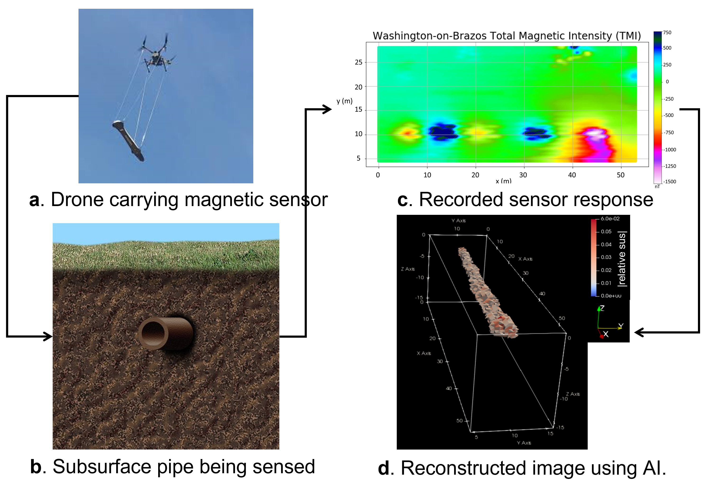
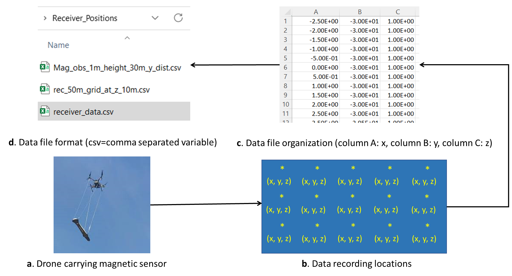
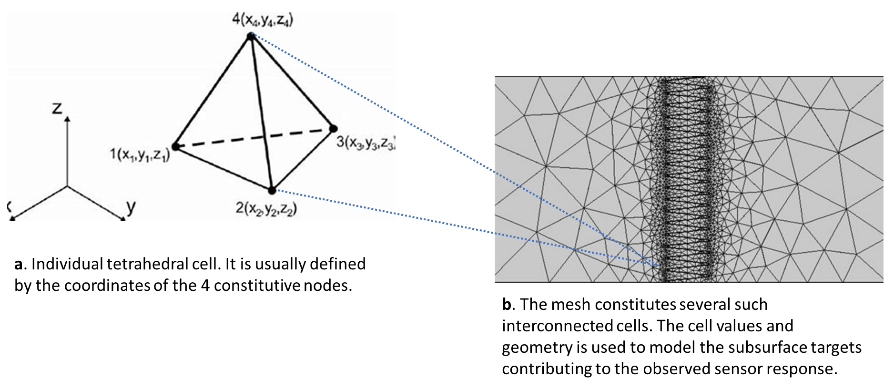
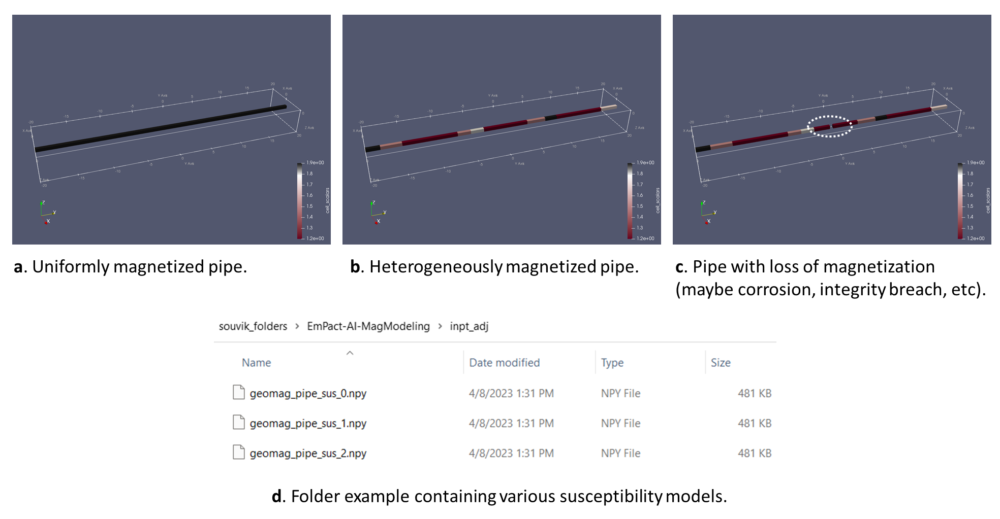

# ISCIML: A command line tool for modeling and generating geophysical data for AI based imaging

## Guide to executing magnetic data modules in docker

### **Introduction**
**Figure 1** depicts a general workflow for imaging buried geophysical targets. The example here is customized for a common use case for this software package: simulating magnetic sensor response due to subsurface magnetic structures like pipes and eventually generating enough data samples that can be trained using a deep learning AI architecture. The actual data acquired in the field will be used by this trained system to infer the subsurface pipe location, geometry and magnetic susceptibility distribution.



To adopt this workflow within a physics guided AI based framework, we need to have the following elements gathered.

### **Input Files and Folder Descriptions**

#### **1. Receiver Locations File**
**Figure 2** illustrates the format and meaning of this file. It shows the x, y, z coordinates (in a right handed system with z- upwards positive sign convention) of the locations at which the sensor records data. The file format is csv or comma separated variable (**Figure 2d**). The order of the coordinates at each location is assumed to be as shown in **Figure 2c**.



 If the file has a header depicting column names then that line will need to be specified in the command line for skipping. Alternatively, if multiple header lines are present, then the total corresponding header lines will need to be specified in the command line for skipping. This issue will be discussed in greater details in a later section.

 #### **2. Tetrahedral Mesh File: vtk format**
 The software is designed to simulate recorded responses due to the presence of magnetized tetrahedral elements in the subsurface. The subsurface is simulated using an unstructured tetrahedral mesh. Each cell in the mesh has a specific susceptibility value **s** assigned to it and magnetization vector specified by *(kx, ky, kz)*. 
 The vtk file contains information about the nodes that constitute and interconnect individual tetrahedral cells in the mesh (**Figure 3**).

 
 
 The [vtk](https://vtk.org/wp-content/uploads/2015/04/file-formats.pdf) is a well known file format supported by open source mesh generation software such as [tetgen](https://wias-berlin.de/software/tetgen/1.5/index.html) and mesh visualization software [paraview](https://www.paraview.org/).

 #### **3. Input Susceptibility Model Folder**
 For training multiple different subsurface models in different geometry, susceptibility distribution, an input folder containing these files need to be created (**Figure 4**). 
 
 

 The current use case is limited to reconstructing images from **Total Magnetic Intensity (TMI)** so the effective susceptibility component in the direction of the ambient geomagnetic field is considered. Thus, for model generation, the numpy files (.npy) present in the folder are 1-D vector arrays of effective susceptibility values. The *length of the vector* corresponds to the *number of cells* in the tetrahedral mesh **vtk file** and the *indices of the vector* coincide with the *indices of the tetrahedral elements* in the **vtk file**.
 
 ### **Getting Started With Docker**
 To pull the docker image it is necessary to start a linux shell with root access. In it execute the following command:

```
$ docker pull s2labs/isciml
```
Once docker is pulled, run the docker image using the command:

```
$ docker run -it s2labs/isciml
```

This will take you inside the docker shell. You will see a change in prompt from `john_doe@DESKTOP-P3DTUJS:~$ ` to something like this: `root@90ac627d5f09:/# `

The characters following `root@` and before `:` provides the CONTAINER ID. So, in this example, the CONTAINER ID is `90ac627d5f09`. This can be verified by running the following command in a separate regular shell (not in the docker prompt).

```
john_doe@DESKTOP-P3DTUJS:~$ docker ps
```
### **Running ISCIML To Generate Data For Training**

From the docker prompt issue the command:

```
root@90ac627d5f09:/# isciml --help
```
This will return the following options:

```
Usage: isciml [OPTIONS]

Options:
  --vtk PATH                      Mesh in vtk file format  [required]
  --receiver_file PATH            Receiver locations file in CSV format [required]
  --receiver_header INTEGER       Header parameter is Union[int, List[int], None]
  --input_folder PATH             Folder with files containing magnetic properties in numpy format [required]
  --ambient_field <FLOAT FLOAT FLOAT>... [default: 820.5, 16241.7, 53380.0]
  --output_folder PATH            Folder with files containing adjoints or forward in numpy format [required]
  --output_prefix TEXT            Output prefix for the file names will be appended to input files. 
                                  Defaults to adjoint for "adjoint" for adjoint mode and "forward" for forward mode
  --solver [adjoint|forward]      Solver mode adjoint or forward  [default:adjoint]
  --help                          Show this message and exit.
```

For script execution, the `[required]` options must be specified, the other options will execute with default values. For *generating training data relevant to the day the survey was done*, it is **necessary to change the default values of the ambient field** to the appropriate values of the survey date.

### **Setting Up Validation Test Run**
Download the `TTI_Test_Docker` folder to your local machine outside docker. The link to this folder will be sent outside this document.

Go back to the docker shell. Verify that you are currently in the `/` docker folder as shown below.
```
root@90ac627d5f09:/# pwd
/
```
Now issue `ls` and then `cd` to the `isciml` folder
```
root@90ac627d5f09:/# ls 
bin   dev  home lib    lib64   media  opt   root  sbin  sys  usr boot  etc  isciml  lib32  libx32  mnt proc  run   srv   tmp  var

root@90ac627d5f09:/# cd isciml
root@90ac627d5f09:/isciml# 
```
Now create a test folder `test_data_gen`. 

Return to local linux/ubuntu shell outside docker. From this separate local linux/ubuntu shell (which is outside docker prompt), import the following files to the docker folder using the specific version of the command:
`sudo docker cp <local file pathname> <CONTAINER ID>:/to-be-copied-to-folder`

As a specific example,
```
john_doe@DESKTOP-P3DTUJS:~$ sudo docker cp TTI_Test_Docker/mesh.vtk 90ac627d5f09:./isciml/test_data_gen/
```
Depending on your user settings, you may be asked for your local password once or everytime you import.

Use the same command to import `receiver_data.csv` file and the `inpt_adj` folder, taking care to use -r as appropriate for copying the folder. 

Now, switch back to `docker shell` which in this specific example is `root@90ac627d5f09:` and navigate to the `isciml/test_data_gen` folder. In this folder create `out_adj` folder.

Now execute the `isciml` script with the following options:
```
isciml --vtk mesh.vtk --receiver_file receiver_data.csv --input_folder inpt_adj --output_folder out_adj --output_prefix test_adjoint --ambient_field 820.5 16241.7 53380.0
```
It may take approximately 9 - 12 minutes to complete execution and generating the 3 output data in the `out_adj` folder.

To speed up the process, we can run this in parallel using mpi.

### **Running ISCIML With MPIRUN**

First step is to create a separate **empty** folder for the output. Let's create this folder as `out_adj_mpi`.

Now, execute the following command from the same `test_data_gen` folder from where the previous call was executed.

```
mpirun --allow-run-as-root --np 2 isciml --vtk mesh.vtk --receiver_file receiver_data.csv --input_folder inpt_adj --output_folder out_adj_mpi --output_prefix test_mpi_adjoint --ambient_field 820.5 16241.7 53380.0
```
The `--np 2` option specifies the number of CPUs that will be used for this run. The docker has rank 2, so only 2 CPUs will be accessed. As this gets transferred to larger machines, the `np x` option will take in larger numbers. The main caveat is that we cannot have `x > number of input npy files` in the `inpt_adj` folder.
